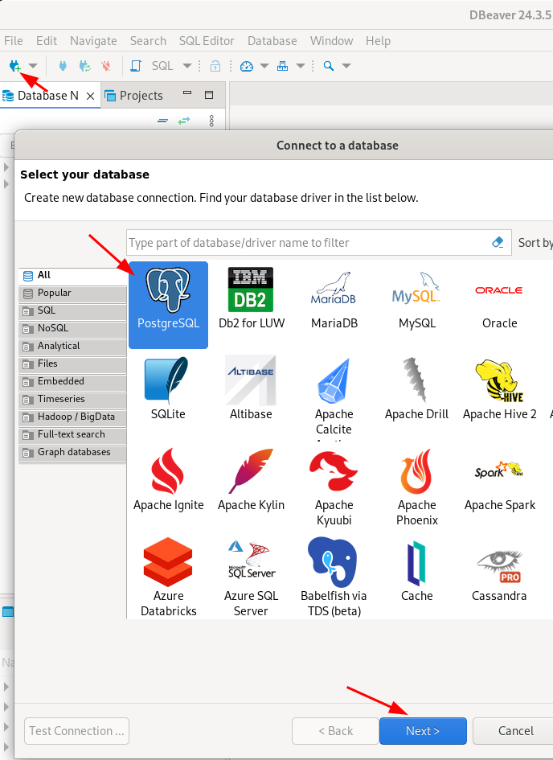
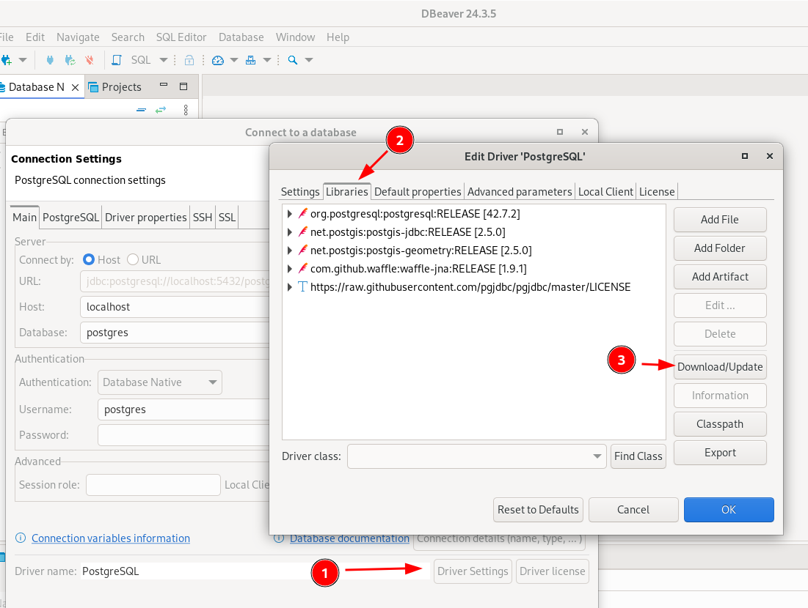
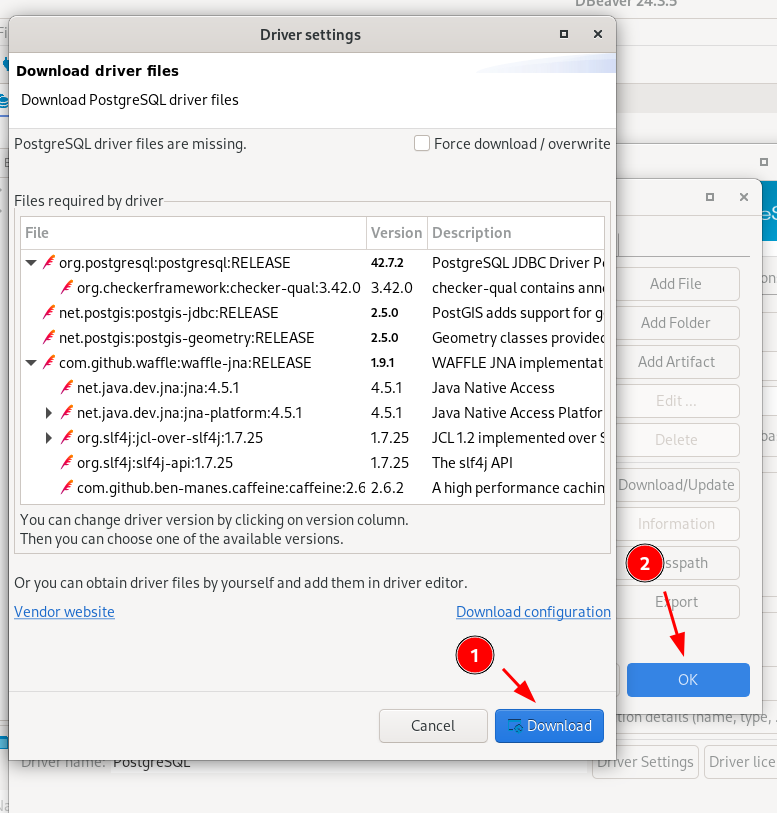
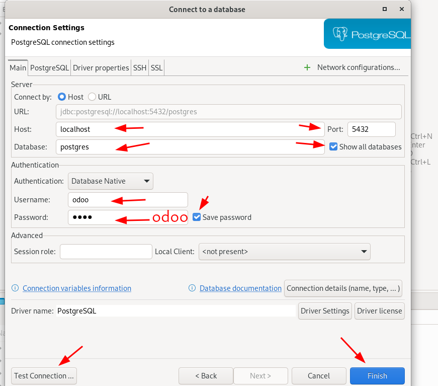

# dbeaver

[WEBSITE](https://dbeaver.io/)

## Install

```sh
wget https://dbeaver.io/files/dbeaver-ce_latest_amd64.deb
sudo dpkg -i dbeaver-ce_latest_amd64.deb
```

## Configure

### New connection



### Install pg drivers (only once time)




### Configure connection


